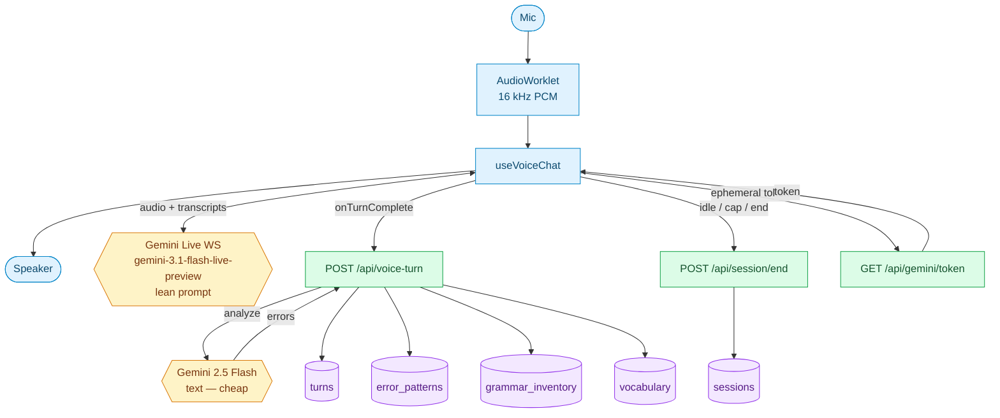

# Pipeline

How a voice conversation flows through the system, what each piece costs, and who owns which data. Update this whenever voice / analysis code changes.

Legend: `[done]` = in place today. `[todo]` = planned optimization (tracked below).

> **Note on session compaction:** this file is the source of truth for the voice pipeline. If the conversation gets compacted and you lose context, re-read this document — it's designed to be enough to re-orient without the thread history.

---

## Conversation flow (target state)



<details>
<summary>ASCII fallback</summary>

```
User speaks
  │
  ▼
Mic → AudioWorklet (public/capture.worklet.js)
  │   16 kHz PCM, 12288-sample frames
  ▼
WebSocket → Gemini Live  (src/lib/gemini-live.ts)
  │   model: gemini-3.1-flash-live-preview
  │   prompt: LEAN voice prompt [todo: compact + cached]
  │   output: audio reply + input/output transcripts
  ▼
Audio → user's speaker (src/lib/audio.ts, 24 kHz playback)

On turnComplete (fired by Gemini):
  │
  ├──▶ POST /api/voice-turn                        [done]
  │     model: gemini-2.5-flash (text, cheap)
  │     in:   user transcript + tutor transcript
  │     out:  error list
  │     writes: turns, error_patterns, grammar_inventory, vocabulary
  │
  └──▶ (no other analysis call; voice-turn is the one)

On idle / cap hit:
  │
  └──▶ WS auto-close [done]  then POST /api/session/end  [done]
        writes: sessions (ended_at, duration)
```

</details>

---

## Model responsibilities

| Call | Model | Job | Reads | Writes | Approx cost / turn |
|---|---|---|---|---|---|
| Gemini Live WS | `gemini-3.1-flash-live-preview` | Sound natural, respond in target language, short replies | Lean voice prompt (learner name, level, 3 focus areas, top-5 due vocab), live audio | Audio out, transcripts | ~$0.003–0.005 after optimizations |
| `/api/voice-turn` | `gemini-2.5-flash` (text) | Extract errors from user's last utterance | User transcript + tutor transcript + learner lang/native | `turns`, `error_patterns`, `grammar_inventory`, `vocabulary` | ~$0.001–0.002 |
| `/api/chat` (text mode only) | `gemini-2.5-flash` (text) | Full tutor — reply + `[ANALYSIS]` JSON | Full learner context (SRS, errors, interests, history) | Same as above, plus corrections | ~$0.004 |
| `/api/analyze` | `gemini-2.5-flash` (text) | Standalone error analyzer (used by text chat input inline) | One sentence | Nothing (returns errors) | ~$0.001 |
| `/api/alongside/transcribe` | `gemini-2.5-flash` (audio) | Whole-file transcript with timestamps | Uploaded audio blob | `alongside_segments`, `alongside_sessions` | ~$0.006 / min audio |

Rule of thumb: **audio tokens are 10–20× more expensive than text tokens**. Anything that can happen on text should happen on text.

---

## Data ownership

| Table | Written by | Read by |
|---|---|---|
| `learners` | auth / onboarding | everyone |
| `sessions` | `/api/voice-turn` (create), `/api/session/end` (close) | dashboard, tutor prompt builder |
| `turns` | `/api/voice-turn`, `/api/chat` | dashboard, `sessions/[id]` page |
| `error_patterns` | `/api/voice-turn`, `/api/chat` | tutor prompt builder, errors page |
| `grammar_inventory` | `/api/voice-turn`, `/api/chat` | tutor prompt builder, grammar page |
| `vocabulary` | `/api/voice-turn`, `/api/chat` | tutor prompt builder, knowledge page |
| `learner_interests` | `/api/interests` | tutor prompt builder |
| `alongside_sessions`, `alongside_segments`, `alongside_interactions` | alongside routes | alongside page |
| `rate_limits` | `rateLimit.ts` RPC | all rate-limited routes |

**Invariant:** the voice WS never writes to the DB directly. All DB writes go through the Next.js API routes.

---

## Why this is cheap (cost levers)

The four things keeping voice cost down — don't break any of these without thinking:

1. **Lean voice prompt.** `buildVoicePrompt()` in `chat/page.tsx` is ~227 tokens (measured on a B1 Korean learner), not the 561+ it was before or the 2–4k the text tutor uses. Full learner context stays out of the audio model.
2. **Analysis is text, not audio.** Error extraction runs in `/api/voice-turn` on Gemini Flash text. Never add `[ANALYSIS]` JSON to the voice model's output.
3. **Reply length is capped.** Voice prompt instructs 1–2 sentences and "end with a question." Output audio tokens cost 4× input — short replies dominate the bill.
4. **Idle disconnect + session cap [done].** Sockets don't stay open forever — 30s silence timeout + 10 min hard cap in `useVoiceChat.ts`. Daily 10-session quota enforced at token mint in `api/gemini/token/route.ts`. Bounds worst-case audio spend to ~100 min/user/day.

If voice cost suddenly spikes, check these four first, in this order.

---

## Cost caps / rate limits

| Scope | Limit | Window | File |
|---|---|---|---|
| `voice-turn` | 60 | 60s | `rateLimit.ts` → `RATE_LIMITS.standard` |
| `alongside-transcribe` | 10 | 60s | `RATE_LIMITS.expensive` |
| `analyze` | 60 | 60s | `RATE_LIMITS.standard` |
| `voice` (sessions/day) | 10 | 86400s (daily) | `rateLimit.ts` → `RATE_LIMITS.voice`; enforced in `api/gemini/token/route.ts` |
| Idle WS disconnect | 30s silence | — | `useVoiceChat.ts` `IDLE_TIMEOUT_MS` |
| Session cap | 10 min | — | `useVoiceChat.ts` `SESSION_CAP_MS` |

---

## Optimization backlog

### Shipped: compact voice prompt (#1 + #3 part 1)

**Where it lives:** `buildVoicePrompt()` in `src/app/(app)/chat/page.tsx`. (Kept here rather than `src/lib/tutor.ts` because the `adaptive` data is client-fetched from `/api/practice`; moving the builder server-side would require piping that data through a new route for no benefit.)

**What changed:**

- **Kept:** language-interpretation rule (stops Gemini hearing Korean as Japanese), top 3 focus areas, top 3 L1 interference patterns, top 3 interests (names only), level label.
- **Cut:** verbose role description, redundant style lecture, level math (data points / mastery %), detailed interest descriptions, **full idiom-teaching and slang-teaching blocks** for English learners (~800–1000 tokens each — the biggest savings). The idiom/slang pedagogy now lives as a single two-line "English nuance" nudge.
- **Baked in (#1):** `Reply in 1–2 short sentences. Never lecture. End with a question to keep them talking.`
- **Moved out:** all the deep context (full learner profile, recent errors, full SRS, grammar inventory, session history) stays on the *text* path. `/api/voice-turn` reruns full analysis on cheap text tokens after each turn.

**Measured reduction (mock B1 Korean learner):** 561 → 227 tokens (59% drop). For English-target learners the drop is larger because the idiom/slang blocks are gone.

**Risk:** worse in-call correction quality. **Mitigation:** async turn analyzer catches what voice misses.

### Ruled out: Gemini context caching on the voice path (#3 part 2)

Investigated 2026-04-21. Two independent blockers:

1. **Live API doesn't accept `cachedContent` in the WS setup message.** `BidiGenerateContentSetup` only supports `model`, `system_instruction`, `generation_config`, and `tools`. The `cachedContent` field exists only on the REST `generateContent` endpoint.
2. **Our prefix is too small anyway.** The minimum cacheable size on Gemini 2.5 Flash (and our `gemini-3.1-flash-live-preview` sibling) is **1,024 tokens**. Our compact voice prompt is ~227 tokens — an order of magnitude below threshold.

**Decision:** stop chasing this. If Google later adds `cachedContent` to Live setup AND our prefix grows past 1,024 tokens, revisit. Both conditions have to hold.

**What we do instead for the voice path:** keep the prefix lean (#3 part 1 already shipped), keep analysis on the cheap text model (#4), and cap runaway sessions (#5). Those three levers are what actually move the bill.

### Shipped: idle + cap + daily limit (#5)

**Why:** the WS stays open as long as the tab is open. A user who walks away with the tab alive keeps the socket billing. #3 lowers per-turn cost; #5 caps the damage if a session runs away.

**What shipped:**

1. **Idle disconnect (30s silence).** `useVoiceChat.ts` has `IDLE_TIMEOUT_MS = 30_000` and `bumpActivity()` resets on every transcript + user-speech-start + turn-complete. On expiry, `teardown()` + `onAutoDisconnect("idle")` fire. Reconnect is a single mic tap.
2. **Hard session cap (10 min).** `SESSION_CAP_MS = 10 * 60 * 1000`. Timer starts in `onConnectionChange(true)`; on expiry, `teardown()` + `onAutoDisconnect("cap")` fire. `chat/page.tsx` surfaces a transient "10 min limit reached — tap mic to continue" notice.
3. **Daily voice session quota.** Couldn't use seconds-based limit — existing `check_rate_limit` RPC is count-based. Switched design to **10 voice sessions per day** paired with the 10-min cap — economically equivalent (≤100 min/user/day) without needing a SQL migration. Enforced in `api/gemini/token/route.ts` before token mint. On 429, the UI shows the server's `message` via the `onError` path.

**Worst-case cap per user:** 10 sessions × 10 min × ~6 turns/min × $0.005/turn ≈ $3/user/day, but realistic usage is a single session ≈ $0.18/day.

**Risk:** engaged user feels cut off at 10 min. **Mitigation:** auto-dismissing notice tells them why and that one tap resumes. 10 min of active voice practice is already a full daily lesson.

### Checklist

- [x] Verify `/api/voice-turn` fires on every `onTurnComplete` — wired in `src/app/(app)/chat/page.tsx` via `useVoiceChat`'s `onTurnComplete` callback; deduped by `savedVoiceTurnsRef` (per user-message id), delayed 1.5s for transcript settling
- [x] Compact `buildVoicePrompt()` in `src/app/(app)/chat/page.tsx` — 561 → 227 tokens on a B1 Korean learner (59% drop); bigger drop for English-target learners
- [x] Reply-length cap embedded in the compact prompt (1–2 sentences, always ask a question)
- [x] Gemini context caching on the voice prompt's static prefix — **ruled out**: Live WS setup doesn't accept `cachedContent`, and our 227-token prefix is below the 1,024-token minimum anyway
- [x] Idle WS disconnect (30s) + session cap (10 min) in `src/hooks/useVoiceChat.ts` — `IDLE_TIMEOUT_MS` / `SESSION_CAP_MS`, `onAutoDisconnect` surfaces UI notice in `chat/page.tsx`
- [x] Daily voice rate limit — `RATE_LIMITS.voice = { limit: 10, windowSec: 86400 }`, enforced at token mint in `api/gemini/token/route.ts` (switched from seconds-based to sessions-based; equivalent ceiling of ~100 min/user/day)
- [ ] (Later) Try half-cascade voice variant
- [ ] (Later) Client-side silence gating in `public/capture.worklet.js`

---

## Where to look

| If you're changing… | Start here |
|---|---|
| What the voice model knows | `src/lib/tutor.ts` → system prompt builder |
| How audio is captured / played | `src/lib/audio.ts`, `public/capture.worklet.js` |
| WS framing + setup message | `src/lib/gemini-live.ts` |
| Voice UI state | `src/hooks/useVoiceChat.ts`, `src/app/(app)/chat/page.tsx` |
| Per-turn analysis | `src/app/(app)/api/voice-turn/route.ts` |
| Text tutor | `src/lib/tutor.ts` `chat()`, `src/app/(app)/api/chat/route.ts` |
| Alongside (listen + transcribe) | `src/app/(app)/api/alongside/*` |
| DB schema | `supabase-*.sql` files in repo root |
| Guest-first / anonymous auth plan | `GUEST_FLOW.md` (not built yet) |
