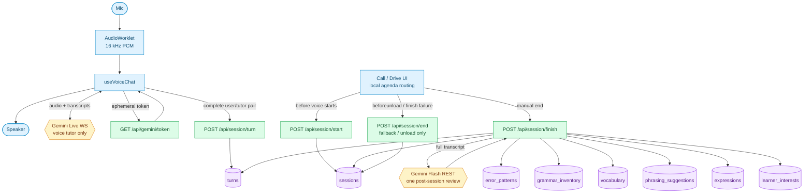

# Pipeline

Current source of truth for the voice pipeline. The app is currently scoped to
English-speaking learners practicing Japanese.

> If session context gets compacted, re-read this file first.

---

## Conversation Flow

Plain English:

1. The UI creates the session before opening the voice socket.
2. Gemini Live only teaches and speaks. It does not emit JSON analysis.
3. Each completed user -> tutor exchange is saved as a raw turn.
4. When the user ends the session, one review pass analyzes the full transcript.
5. That finish pass writes the durable learning artifacts for future sessions.

---

## No Per-Turn Analysis

The active voice pipeline no longer calls `/api/voice-turn` after every exchange.
That route can remain as legacy code, but Call and Drive should not depend on it.

Why:

- Per-turn analysis created more moving parts than value.
- The tutor can already react live because Gemini Live has the prompt, the learner level, drill words, and the live transcript context.
- Durable learning state is more reliable when extracted from the full transcript, because the reviewer can see repeated patterns instead of isolated fragments.

What still happens on the fly:

- Gemini Live does immediate teaching through recasts, short corrections, follow-up questions, and prompt-driven mode behavior.
- `InCall` locally routes the visible agenda strip from early user/tutor messages, so the UI can adapt without server analysis.
- The next session adapts from persisted artifacts created by `/api/session/finish`.

What does not happen on the fly:

- New SRS words are not added mid-call.
- Error patterns, grammar inventory, phrasing suggestions, expressions, and interests are not persisted until session finish.

---

## Endpoint Responsibilities

| Endpoint | Active voice path? | Job | Writes |
|---|---:|---|---|
| `GET /api/gemini/token` | yes | Mint short-lived Gemini Live token; enforce daily voice quota | `rate_limits` |
| `POST /api/session/start` | yes | Create a `sessions` row before voice starts | `sessions` |
| `POST /api/session/turn` | yes | Save one raw user/tutor exchange, no LLM call | `turns` |
| `POST /api/session/finish` | yes | Run one full-transcript review and persist learning state | `sessions`, `turns.analysis_json`, learning tables |
| `POST /api/session/end` | fallback | Mark a session ended without analysis, used for unload/failure paths | `sessions` |
| `POST /api/chat` | text mode | Text tutor response plus inline JSON analysis | `turns`, learning tables |
| `POST /api/analyze` | utility | Standalone sentence analysis | none |
| `POST /api/review` | legacy/deep review | Older multi-pass review route | learning tables |
| `POST /api/voice-turn` | legacy | Older per-turn voice analysis route | `turns`, learning tables |

---

## Data Ownership

| Table | Written by | Read by |
|---|---|---|
| `learners` | auth / onboarding | all learner-aware routes |
| `sessions` | `/api/session/start`, `/api/session/finish`, `/api/session/end` | dashboard, session pages, prompt context |
| `turns` | `/api/session/turn`, `/api/session/finish`, `/api/chat` | dashboard, session pages, recap helpers |
| `error_patterns` | `/api/session/finish`, `/api/chat` | prompt context, errors page |
| `grammar_inventory` | `/api/session/finish`, `/api/chat` | prompt context, grammar page |
| `vocabulary` | `/api/session/finish`, `/api/chat`, explicit learn routes | prompt context, knowledge page |
| `phrasing_suggestions` | `/api/session/finish`, `/api/review` | review/history surfaces |
| `expressions` | `/api/session/finish`, `/api/review` | prompt context, knowledge surfaces |
| `learner_interests` | `/api/session/finish`, `/api/interests` | prompt context |
| `alongside_sessions`, `alongside_segments`, `alongside_interactions` | alongside routes | alongside page |
| `rate_limits` | `rateLimit.ts` RPC | all rate-limited routes |

Invariant: the Gemini Live WebSocket never writes to the database directly.
Every durable write goes through a Next.js API route.

---

## Cost Levers

1. Keep Gemini Live focused on speaking and listening, not structured analysis.
2. Save raw transcripts during the call; analyze once with cheap text tokens at the end.
3. Keep voice replies short: 1-2 sentences, usually ending with a question.
4. Keep the voice prompt lean; full learner history belongs on text/review paths.
5. Bound runaway sockets with the 30s idle timeout, 10 min hard cap, and daily session quota.

---

## Rate Limits

| Scope | Limit | Window | File |
|---|---:|---:|---|
| `voice` | 10 sessions | 86400s | `src/lib/rateLimit.ts`, enforced in `api/gemini/token/route.ts` |
| `session-finish` | 10 calls | 60s | `src/lib/rateLimit.ts` |
| `voice-turn` | standard profile | 60s | legacy route only |
| `analyze` | standard profile | 60s | `src/lib/rateLimit.ts` |
| `alongside-transcribe` | expensive profile | 60s | `src/lib/rateLimit.ts` |
| Idle WS disconnect | 30s silence | - | `src/hooks/useVoiceChat.ts` |
| Session cap | 10 min | - | `src/hooks/useVoiceChat.ts` |

---

## Where To Look

| Changing... | Start here |
|---|---|
| Voice lifecycle state | `src/hooks/useVoiceChat.ts` |
| Call-mode session wiring | `src/components/InCall.tsx` |
| Drive-mode session wiring | `src/app/(app)/drive/page.tsx` |
| Session start / raw turns / finish review | `src/app/(app)/api/session/*/route.ts` |
| Post-session persistence helpers | `src/lib/db.ts` |
| English -> Japanese call prompts | `src/lib/prompts/ja/` |
| Gemini Live socket framing | `src/lib/gemini-live.ts` |
| Audio capture and playback | `src/lib/audio.ts`, `public/capture.worklet.js` |
| Text tutor path | `src/app/(app)/api/chat/route.ts`, `src/lib/tutor.ts` |
