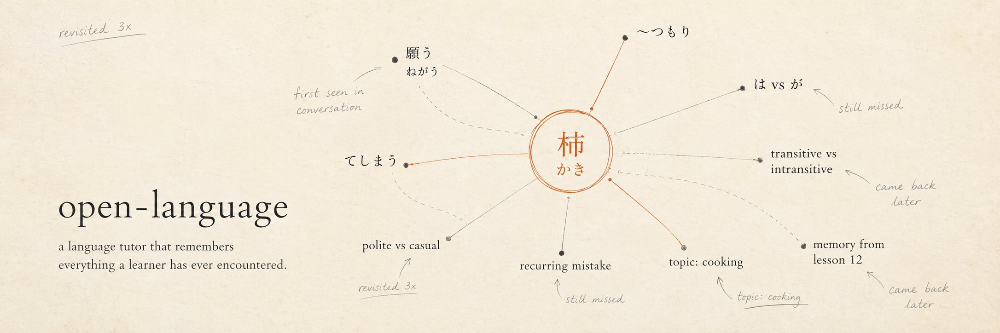

# open-language



A language tutor that actually remembers you — vocab you've looked up, mistakes you keep making, topics you care about — across every session.

> **Try it hosted:** [open-language-nine.vercel.app](https://open-language-nine.vercel.app)
> No setup, free to start. Self-host below if you'd rather run your own.

---

## See it in 60 seconds

A short Japanese conversation between a tutor and a learner. Watch the right-hand panel — every word, grammar pattern, and mistake is captured, and the next session uses that memory.

<video src="https://github.com/jeeminhan/open-language/raw/main/docs/assets/demo.mp4" controls width="720"></video>

[▶ Watch the live demo](https://open-language-nine.vercel.app/demo) · [Download the video](docs/assets/demo.mp4)

---

## Status & related work

`open-language` is the original full-stack app: persistent learner memory, Next.js dashboard, Python CLI, Supabase backend.

Active research has since moved to a focused successor:

> **[minshuku](https://github.com/jeeminhan/minshuku)** — the current iteration. A text-based Japanese conversation practice system focused on **scene generation, rule-based evaluation, and a two-layer testing pipeline for LLM quality regressions.** Smaller surface area, deeper investigation of the scene-runs / SRS / evaluator loop. Where `open-language` answers "what does a remembering tutor look like as a product?", `minshuku` answers "how do you keep an LLM-graded learning loop honest?"

This repo remains the reference implementation of the broader product. Architectural decisions made here (SRS schema, error-pattern tracking, learner state model) carry forward into minshuku.

---

## What it does

- **Persistent vocab tracking** — every word you look up (e.g. 柿 / persimmon) is remembered, scheduled with SRS, and resurfaced when due.
- **Error grouping by root cause** — repeated mistakes (は vs が, transitive/intransitive pairs) are grouped, not logged as 50 separate events.
- **Interest-based personalization** — the tutor uses topics you care about to keep practice grounded.
- **Spaced-repetition quizzes** — backed by per-item SRS state in Supabase.
- **Bilingual EN ↔ JA practice** — across both the dashboard and the CLI.

---

## How it works

```
1. You talk to the tutor    →  Next.js dashboard or Python CLI
2. The tutor logs the turn  →  Supabase: turns, vocabulary, error_patterns
3. The analyzer extracts    →  vocab introduced, mistakes made, topics raised
4. SRS schedules review     →  vocab_srs / grammar_srs intervals
5. Next session loads state →  learner cache surfaces what's due + what you care about
6. Sessions feed back in    →  every interaction enriches the learner profile
```

The point: a session is not isolated. Each one builds on the persistent learner record, which is the whole product thesis.

---

## Stack

- **Next.js (App Router)** — dashboard at `src/app/`
- **Python** — CLI tutor at `cli/` (voice-capable)
- **Supabase** — Postgres + auth + RLS for learner state
- **OpenAI-compatible LLM** — works with OpenAI, Together, OpenRouter, local Ollama, etc.
- **pytest** — two-layer test suite (see Testing)

---

## Data model

Persistent learner state lives in Supabase. Migrations are in `supabase-*.sql` at the repo root.

### Curriculum (shared content)

| Table | Purpose |
|---|---|
| `vocab_items` | JLPT-tagged vocabulary catalog |
| `grammar_items` | Grammar pattern catalog |
| `kanji_items` | Kanji catalog |
| `frequency_ranks` | Word frequency for prioritization |
| `example_sentences` | Source sentences per item |

### Learner state (per user)

| Table | Purpose |
|---|---|
| `learners` | Profile, level, target language |
| `sessions` | One row per tutoring session, with summary |
| `turns` | Every utterance in a session |
| `vocabulary` | Words introduced to this learner |
| `learner_known_vocab` / `learner_known_grammar` | What this learner has demonstrated |
| `error_patterns` | Recurring mistakes, grouped by root cause |
| `avoidance_patterns` | Things the learner consistently dodges |
| `learner_interests` | Topics surfaced from conversation |
| `topic_cache` | Reusable topic context |
| `expressions` / `phrasing_suggestions` | Suggested phrasings the learner has seen |

### SRS

| Table | Purpose |
|---|---|
| `vocab_srs` | Per-learner-per-vocab interval, ease, next review |
| `grammar_srs` | Same, for grammar patterns |

The SRS layer is what makes the tutor "remember" — without it, every session starts from zero.

---

## Layout

```
src/
  app/             Next.js routes — dashboard, call UI, onboarding, auth
  lib/
    tutor.ts            Main tutor pipeline
    agendaRouter.ts     Decides what to surface this session
    learnerCache.ts     Loads + caches per-learner state
    sessionLogger.ts    Persists turns / sessions to Supabase
    scenes/             Scene-style practice modules
    curriculum/         Curriculum loaders
    prompts/            System prompts (shared with CLI)
    gemini-live.ts      Voice/live integration
    rateLimit.ts, promptSafety.ts, bodyLimit.ts

cli/                CLI tutor (Python)
  main.py             Entry point
  tutor.py            Conversational loop
  analyzer.py         Extracts vocab, errors, topics from turns
  database.py         Local SQLite + Supabase sync
  voice/              Voice-mode runtime
  tests/              See Testing

data/
  raw/, processed/, generated/   Curriculum sources & derived assets

scripts/
  curriculum/          Curriculum import + enrichment

supabase-*.sql       Database migrations (run in order)
```

---

## Testing

The tutor's job is to produce good language output. Most of what determines "good" is downstream of an LLM call, so the test suite is split into two layers with very different speed/cost profiles.

### The problem

- **Code regressions** — the analyzer stops extracting vocab, the SRS interval math drifts, a Supabase write silently fails. Cheap to catch with unit tests.
- **Quality regressions** — a prompt change makes the tutor over-correct, refuse to translate, or hallucinate vocab the learner never said. No unit test sees these.

So we run two layers and don't pretend one replaces the other.

### Layer 1 — Unit tests (fast, free)

Mock the LLM. Verify prompt wiring, response parsing, and the deterministic plumbing around it.

```bash
cd cli
.venv/bin/pytest
```

Covers prompt wiring (`tests/unit/test_prompt_wiring.py`) and the analyzer/database glue. This layer gates iteration speed — if it's slow or flaky, prompt work grinds to a halt.

### Layer 2 — Eval suite (slow, calls real LLM)

Runs a fixed set of scenarios in `cli/tests/evals/scenarios.yaml` against the real model and asserts output shape, language, and analysis structure. Each scenario writes a JSON artifact to `cli/tests/evals/runs/<timestamp>/<scenario>.json` so prompt iterations can be diffed.

```bash
cd cli
.venv/bin/pytest -m eval
```

Assertion types currently supported:

| Type | Checks |
|---|---|
| `response_contains_any` | response text contains at least one listed string |
| `response_language` | response contains characters from the given script (e.g. `hiragana_or_katakana`, `hangul`) |
| `analysis_has_key` | analysis JSON is present and contains the given key |
| `analysis_errors_nonempty` | `analysis.errors` is a non-empty list |

The eval suite is the regression net for *quality*. When a prompt change improves one scenario and quietly breaks another, this is the layer that catches it.

### Iterating on prompts

1. Run the eval once and inspect `cli/tests/evals/runs/<latest>/`.
2. Edit `prompts/system.txt` (root — shared with the dashboard).
3. Re-run. Diff old vs new run directories:
   ```bash
   diff -r cli/tests/evals/runs/<old-ts> cli/tests/evals/runs/<new-ts>
   ```
4. Add scenarios to `scenarios.yaml` as you discover regressions in the wild.

### Why both layers

| Question | Answered by |
|---|---|
| Did I break the code? | Layer 1 (`pytest`) |
| Did I break tutor quality? | Layer 2 (`pytest -m eval`) |
| Is my prompt change actually better? | Diff Layer 2 run artifacts |

Layer 1 is the gate. Layer 2 is the radar. The successor project (`minshuku`) extends this philosophy further — adding a 0–100 LLM-judged scoring layer, finding attribution to upstream causes (template / generator / LLM), multi-session trend tracking, and a variance-check workflow that separates real signal from LLM-grader noise.

---

## Hosted vs self-hosted

This repo is the full app — Python CLI + Next.js dashboard. You can run everything locally with your own API keys (see Setup).

A hosted version is at [open-language-nine.vercel.app](https://open-language-nine.vercel.app) for anyone who'd rather skip setup. Same code, managed infra. Pricing TBD.

---

## Setup

Self-hosting needs three things: the Next.js dashboard, the Python CLI, and a Supabase project.

### 1. Clone and install

```bash
git clone https://github.com/jeeminhan/open-language.git
cd open-language
npm install
```

### 2. Supabase

Create a free project at [supabase.com](https://supabase.com), then grab your **Project URL**, **anon key**, and **service role key** from Project Settings → API.

Run the migrations in order:

```text
supabase-migration.sql
supabase-auth-migration.sql
supabase-add-user-id.sql
supabase-add-session-summary.sql
supabase-curriculum.sql
supabase-vocab-srs.sql
supabase-grammar-srs.sql
supabase-grammar-srs-backfill.sql
supabase-interests-facts.sql
supabase-rate-limits.sql
supabase-alongside.sql
```

### 3. Environment variables

Create `.env.local` in the repo root:

```bash
# Supabase
NEXT_PUBLIC_SUPABASE_URL=https://your-project.supabase.co
NEXT_PUBLIC_SUPABASE_ANON_KEY=your-anon-key
SUPABASE_SERVICE_ROLE_KEY=your-service-role-key

# LLM (OpenAI-compatible)
LLM_API_KEY=sk-...
LLM_BASE_URL=https://api.openai.com/v1
LLM_MODEL=gpt-4o-mini

# Optional: web search for vocab examples
GOOGLE_SEARCH_API_KEY=
GOOGLE_SEARCH_CX=

# Optional: comma-separated user IDs with admin access
ADMIN_USER_IDS=
```

### 4. Run the dashboard

```bash
npm run dev
```

Open [http://localhost:3000](http://localhost:3000).

### 5. Python CLI (optional)

```bash
cd cli
python -m venv .venv
source .venv/bin/activate
pip install -r requirements.txt
python main.py
```

The CLI reads the same `LLM_*` variables from `.env.local`. See `cli/` for voice mode, push-to-talk, and other options.

---

## Conventions

- **Migrations are append-only.** Don't rewrite a past `supabase-*.sql`; add a new one.
- **Prompts are shared** between dashboard and CLI via `prompts/system.txt`. The eval suite covers both surfaces because of this.
- **Learner state is the product.** Code that touches learner tables (`vocabulary`, `error_patterns`, `*_srs`) gets unit + eval coverage.
- **For the next iteration of the testing/eval architecture, see [minshuku](https://github.com/jeeminhan/minshuku).**
